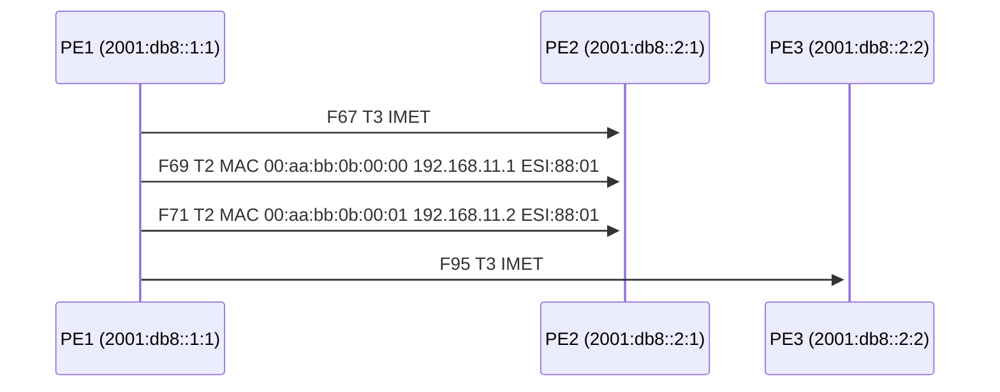

# EVPN-PCAP-Check

A BGP/EVPN packet capture consistency checker. Decodes PCAP files with
`tshark`, extracts BGP sessions and EVPN routes, and runs a suite of
validation rules to detect misconfigurations, missing state, and
anomalies.

## Installation

```bash
# From the repository root
pip install -e ".[test]"
```

Requires **tshark** (Wireshark CLI) on the `PATH`.

## Linux Command-Line Setup

From a fresh shell on Linux, start in the repository root and install the
package into a virtual environment:

```bash
cd /path/to/evpnpcapcheck
python3 -m venv .venv
source .venv/bin/activate
python -m pip install --upgrade pip
python -m pip install -e ".[test]"
```

Confirm the external dependency is available:

```bash
tshark -v
```

If `tshark` is missing, install Wireshark CLI with your distro package
manager, then rerun the command above.

Once installed, run the tool with the console script from the activated
environment:

```bash
evpnpcapcheck --help
evpnpcapcheck verify examples/moderate_001.pcap --partial-capture --summary-only
```

If you prefer not to activate the environment, call the script directly:

```bash
./.venv/bin/evpnpcapcheck --help
./.venv/bin/evpnpcapcheck verify examples/moderate_001.pcap --partial-capture --summary-only
```

Note: the checker exits with status `1` when it finds `FAIL` results. That
means the capture triggered validation failures, not that the CLI failed to
start.

## Quick Start

```bash
# Run all consistency checks on a capture
evpnpcapcheck verify capture.pcapng

# Mid-session capture — skip checks that need the BGP OPEN exchange
evpnpcapcheck verify capture.pcapng --partial-capture

# Summary counts only, no individual findings
evpnpcapcheck verify capture.pcapng --partial-capture --summary-only
```

## Commands

### `verify` — Run Consistency Checks

```bash
evpnpcapcheck verify <pcap> [options]
```

| Option | Description |
|--------|-------------|
| `--partial-capture` | Relax checks that require the BGP OPEN exchange |
| `--summary-only` | Print only summary counts and per-rule table |
| `--scenario FILE` | YAML file describing expected peers and services |
| `--topology FILE` | YAML topology file (enables topology-aware checks) |
| `--format json` | Output findings as JSON instead of Markdown |
| `-o FILE` | Write output to a file |

Example output (summary-only):

```
# EVPN-PCAP-Check Report

## Summary

- **FAIL**: 0
- **WARN**: 437
- **INFO**: 0

### By Rule

| Rule | Severity | Count |
|------|----------|-------|
| EVPN-005 | WARN | 217 |
| EVPN-007 | WARN | 220 |
```

### `ladder` — Sequence (Ladder) Diagram

Generate a Mermaid sequence diagram showing EVPN route exchanges
between PEs.

```bash
# All route types, first 200 messages
evpnpcapcheck ladder capture.pcapng

# Filter to a specific MAC
evpnpcapcheck ladder capture.pcapng --mac 00:aa:bb:0b:00:00

# Only Type 2 and Type 3 routes, limit to 50 messages
evpnpcapcheck ladder capture.pcapng --types 2,3 --limit 50

# Save to file
evpnpcapcheck ladder capture.pcapng --mac 00:aa:bb:0b:00:00 -o diagram.md
```

The output is a Mermaid `sequenceDiagram` block that can be rendered by
GitHub, GitLab, Confluence, or any Mermaid-compatible viewer.

Example:



### `timeline` — Route Timeline

```bash
evpnpcapcheck timeline capture.pcapng
evpnpcapcheck timeline capture.pcapng -o timeline.md
```

Prints a Markdown table showing every EVPN route in frame order, with
route type, RD, MAC, IP, next-hop, and withdrawal status.

### `mac-table` — Reconstructed MAC Table

```bash
evpnpcapcheck mac-table capture.pcapng
evpnpcapcheck mac-table capture.pcapng --evi 100
```

Reconstructs the MAC forwarding table from Type 2 routes, showing the
current state of each MAC including move count and active/withdrawn
status.

### `dump-fields` — Debug Field Discovery

```bash
evpnpcapcheck dump-fields capture.pcapng --contains evpn
```

Lists all tshark JSON field names found in the capture with sample
values. Useful for debugging extraction issues with different tshark
versions.

## Validation Rules

| Code | Severity | Description |
|------|----------|-------------|
| BGP-001 | FAIL | UPDATE received before OPEN on a session |
| BGP-002 | FAIL | Traffic after NOTIFICATION (session should be terminated) |
| BGP-003 | WARN | Route Refresh sent without negotiated capability |
| EVPN-001 | FAIL | EVPN UPDATE on session without L2VPN/EVPN capability |
| EVPN-002 | WARN | Type 2 MAC advertisement without corresponding Type 3 IMET |
| EVPN-003 | WARN | Type 2 MAC advertisement precedes Type 3 IMET |
| EVPN-004 | WARN | MAC withdrawal without prior advertisement |
| EVPN-005 | WARN/FAIL | MAC move detected (WARN for normal failover; FAIL if ≥10 moves) |
| EVPN-006 | WARN | Route Target→EVI mapping doesn't match scenario |
| EVPN-007 | WARN | MAC has only a single advertising PE (no redundancy) |
| MH-001 | FAIL | Type 2 route with non-zero ESI but no matching Type 1 A-D |
| TOPO-001 | WARN | PE declared in topology has no BGP session in capture |
| TOPO-002 | WARN | PE declared in topology advertises no EVPN routes |
| TOPO-003 | FAIL | Route next-hop does not match any known PE loopback |
| TOPO-004 | WARN | ESI-sharing PEs: one PE missing Type 1/4 routes for shared ESI |
| TOPO-005 | INFO | MAC single-homed on a PE that has a shared ESI |
| SCEN-001 | WARN | Expected BGP peer not found in capture |
| SCEN-002 | WARN | Expected IMET not found for a peer |

**Note**: TOPO-* rules only run when `--topology` is provided. EVPN-007
confidence is adjusted from "low" to "high" when topology confirms the PE
should be multi-homed but only one PE advertises the MAC. EVPN-007 findings
for confirmed single-homed PEs are suppressed entirely with topology.

## Topology-Aware Verification

When you have knowledge of the underlying network topology, provide it to
get more accurate validation results:

```bash
evpnpcapcheck verify capture.pcapng --topology topology.yaml
```

The topology YAML describes PE nodes, route reflectors, and their
loopback addresses.  PEs that share an ESI are identified as a
multi-homing pair:

```yaml
as_number: 65001
capture_vantage: RR1

route_reflectors:
  - id: RR1
    loopback: "2001:db8::1:1"
    bgp_id: "10.0.0.1"

pe_nodes:
  - id: PE1
    loopback: "2001:db8::2:1"
    bgp_id: "10.0.0.11"
    esi: "00:11:22:33:44:55:66:77:88:01"
  - id: PE2
    loopback: "2001:db8::2:2"
    bgp_id: "10.0.0.12"
    esi: "00:11:22:33:44:55:66:77:88:01"  # same ESI = multi-homed pair
  - id: PE3
    loopback: "2001:db8::2:3"
    bgp_id: "10.0.0.13"
    # no esi = single-homed
```

This format is compatible with the synthetic PCAP generator's topology
files — the same YAML can be used with both tools.

### What topology enables

| Without topology | With topology |
|-----------------|---------------|
| EVPN-007 fires for every single-PE MAC (low confidence) | Only fires for MACs on multi-homed PEs (high confidence) |
| No way to detect missing PEs | TOPO-001/002 flag PEs with no sessions or routes |
| Unknown next-hops go unnoticed | TOPO-003 flags routes from undeclared PEs |
| ESI consistency unchecked | TOPO-004 catches incomplete multi-homing |

## Running Tests

```bash
pip install -e ".[test]"
pytest tests/ -v
```

## Future Enhancements

- **BGP OPEN capability diff**: Compare negotiated capabilities between
  peers and flag mismatches (e.g. one side offers Graceful Restart, the
  other does not).
- **Per-EVI health dashboard**: Aggregate findings by EVI/service
  instance to give a per-service health score.
- **Temporal analysis**: Detect convergence time by measuring the
  interval between a withdrawal and the subsequent re-advertisement
  from a backup PE.
- **Type 5 IP Prefix route validation**: Verify that IP prefix routes
  carry correct gateway IPs and route targets for L3VPN/EVPN
  inter-subnet routing.
- **BFD correlation**: When BFD packets are present, correlate BFD
  session flaps with BGP/EVPN route withdrawals to identify root
  causes.
- **Multi-capture comparison**: Diff findings between two captures
  (e.g. before/after a config change) to show what improved or
  regressed.
- **HTML report output**: Render findings with embedded interactive
  Mermaid diagrams, sortable tables, and charts.
- **Scenario auto-generation**: Infer a scenario YAML from a healthy
  baseline capture that can then be used to validate future captures.
- **EVPN Type 2 ARP/ND suppression verification**: Check that ARP
  replies sourced from VTEP match the MAC/IP bindings advertised in
  Type 2 routes.
- **Rate-of-change alerting**: Flag unusually high route churn within a
  time window (e.g. >1000 updates/second) as a potential control-plane
  storm.
- **ESI consistency checks**: Verify that all PEs advertising the same
  ESI agree on the Designated Forwarder election result (DF bits in
  Type 4 routes).
- **Integration with CI pipelines**: Exit with non-zero status on FAIL
  findings (already supported) and produce JUnit XML output for test
  frameworks.
